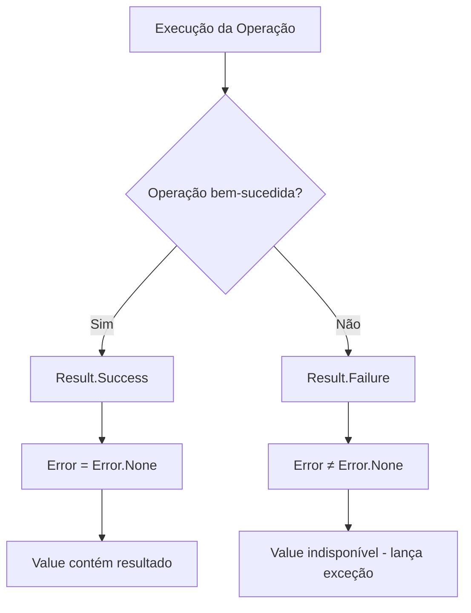

# Componente: Result

O padrão **Result** é um componente fundamental (*Foundation*) da plataforma projetado para encapsular o resultado de qualquer operação de domínio ou caso de uso, eliminando a necessidade de utilizar exceções para controle de fluxo de negócios.

## Propósito Arquitetural

Em um sistema baseado em DDD e Clean Architecture, falhas de negócio (como "saldo insuficiente" ou "e-mail duplicado") não são exceções do sistema, mas sim resultados esperados. O `Result` fornece uma estrutura funcional fortemente tipada para representar **Sucesso** ou **Falha** de forma expressiva e determinística.

## Diagrama Visual



### Benefícios

- **Contratos explícitos:** o método declara no próprio retorno que uma operação pode resultar em sucesso ou falha.
- **Fluxo previsível:** falhas esperadas não dependem de exceções para controlar o fluxo.
- **Composição:** permite encadear operações de forma previsível.
- **Tipagem forte:** sucesso e falha fazem parte do contrato de compilação.
- **Performance:** evita o custo associado ao uso de exceções para situações esperadas.

## Quando utilizar

O `Result` deve ser utilizado quando uma operação pode falhar de forma
esperada por uma regra de negócio ou validação conhecida.

Exemplos:

- criação de usuário;
- alteração de dados;
- validação de domínio;
- criação de contrato;
- operação financeira;
- transição de estado;
- execução de um caso de uso.

## Quando NÃO utilizar

O `Result` não deve ser utilizado como substituto universal para exceções.

Não utilizar `Result` para:

- erros inesperados de programação;
- falhas catastróficas;
- corrupção de estado;
- violações de invariantes internas;
- exceções de infraestrutura que devem ser tratadas por políticas específicas;
- situações em que a operação não possui uma falha esperada representável no contrato.

---

## Invariantes Fundamentais (V1)

O componente `Result` garante invariantes rigorosos:

| Invariante | Comportamento | Exceção |
|---|---|---|
| **Success nunca contém null** | `Result.Success<T>(null)` é rejeitado | `ArgumentNullException` |
| **Success sempre tem Error.None** | Garantido internamente; consumer vê `IsSuccess ⇒ Error == Error.None` | — |
| **Failure nunca contém Error.None** | `Result.Failure(Error.None)` é rejeitado | `ArgumentException` |
| **Failure nunca contém null** | `Result.Failure(null)` é rejeitado | `ArgumentNullException` |
| **Value inacessível em Failure** | Acessar `Result<T>.Value` quando `IsFailure` lança | `InvalidOperationException` |
| **Result<T> é imutável** | Nenhuma propriedade pode mudar após construção | — |
| **Result<T> é sealed** | Não pode ser herdada; design final | — |

---

## Padrão de Consumo: Match

O `Result` oferece `Match` — um padrão funcional para consumir sucesso ou falha de forma segura e tipada:

```csharp
// Sucesso com valor
var result = Result.Success(user);
string message = result.Match(
    onSuccess: user => $"Bem-vindo {user.Name}",
    onFailure: error => $"Erro: {error.Code}"
);

// Sucesso sem valor
var result = Result.Success();
string message = result.Match(
    onSuccess: () => "Operação concluída",
    onFailure: error => $"Erro: {error.Code}"
);
```

Ambas as sobrecargas exigem delegates válidos (não null) e são síncronas na V1.